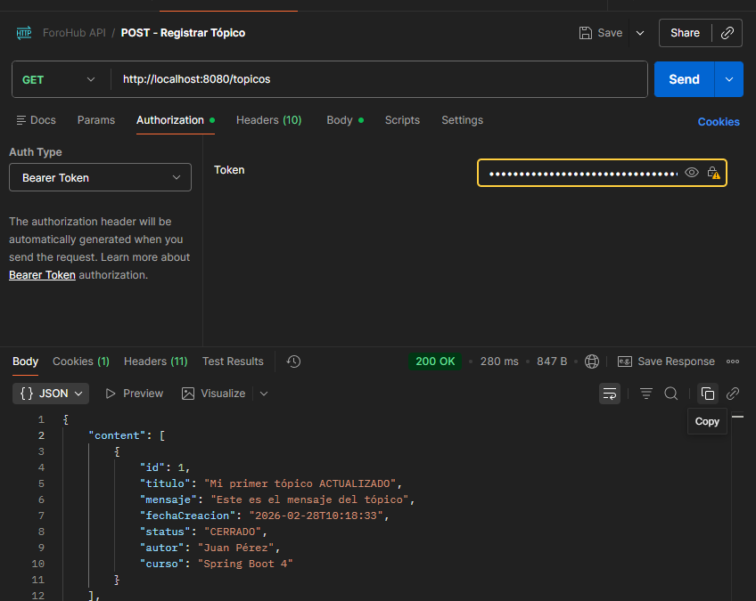

<h1 align="center">ForoHub PWA - Desafío Alura LATAM</h1>

  
  
  
  
  
  

---

## 🚀 Sobre el Proyecto

ForoHub es una Progressive Web Application (PWA) construida como proyecto final para el *Challenge Back-End* de Alura LATAM y Oracle Next Education. Consiste en una arquitectura **Cliente-Servidor (Stateless)** moderna que emula el funcionamiento de StackOverflow o un foro de aprendizaje interactivo.

La plataforma está diseñada con una estricta separación de responsabilidades:
- **Backend (API REST):** Desarrollado en Java 25 y Spring Boot 4, ofrece seguridad robusta mediante Spring Security y **JSON Web Tokens (JWT)**.
- **Frontend (SPA):** Desarrollado con React y Vite, prestando una UI con tema oscuro, glassmorphism y ruteo protegido.

 

    <h3>Pantalla de Autenticación</h3>
    

 

## ⚙️ Arquitectura Multi-Cloud

Este proyecto está 100% alojado en la nube con un pipeline CI/CD activo.

*   **Persistencia:** La Base de Datos Relacional (MySQL) se encuentra orquestada en la nube por **Aiven**, recibiendo migraciones automáticas mediante *Flyway*.
*   **Contenedor API:** El Backend de Spring Boot fue dockerizado (multi-stage file) y se ejecuta continuamente como un *Web Service* en **Render**.
*   **Cliente CDN:** El Frontend en React está desplegado y servido globalmente con baja latencia mediante la red perimetral de **Vercel**.

 

    <h3>Dashboard Privado (Rutas Protegidas E2E)</h3>
    

 

## 🛠️ Tecnologías y Dependencias Principales

**Backend (`/`):**
- Spring Web, Spring Data JPA, Spring Security.
- MySQL Connector J / Flyway Migration.
- JWT (Auth0 jsr310).
- Lombok y Spring Boot DevTools.
- Springdoc (Swagger UI OpenAPI).

**Frontend (`/forohub-frontend/`):**
- React Vite.
- React Router DOM (v6+).
- Lucide React (Icons).
- Vanilla CSS Variables.

---

> Desafío de programación completado y documentado exhaustivamente bajo control de versiones Git en Marzo de 2026. Alura Latam ONE.
