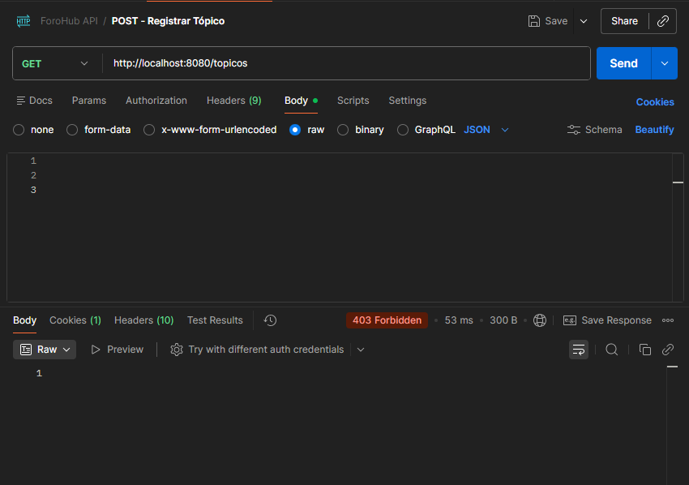
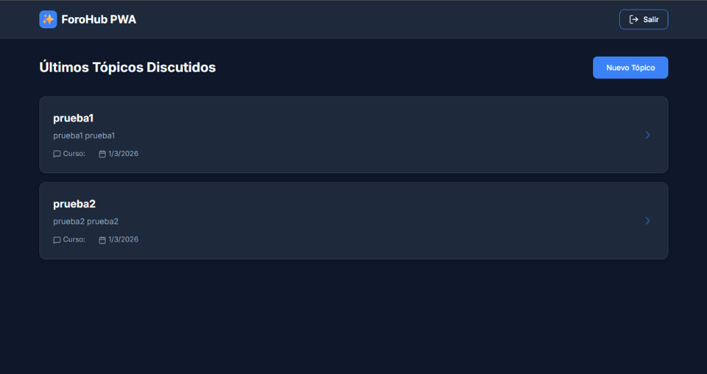
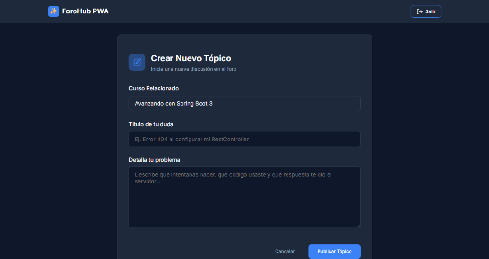
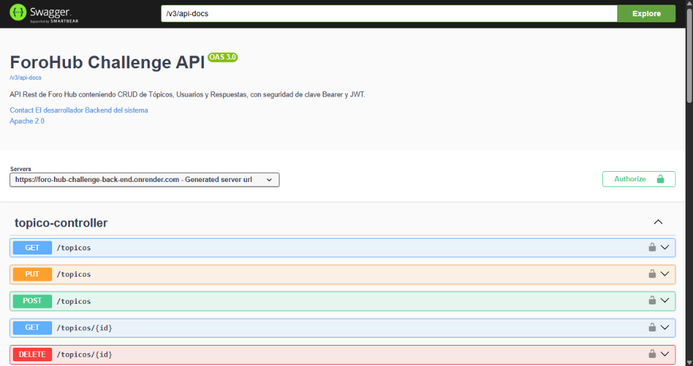
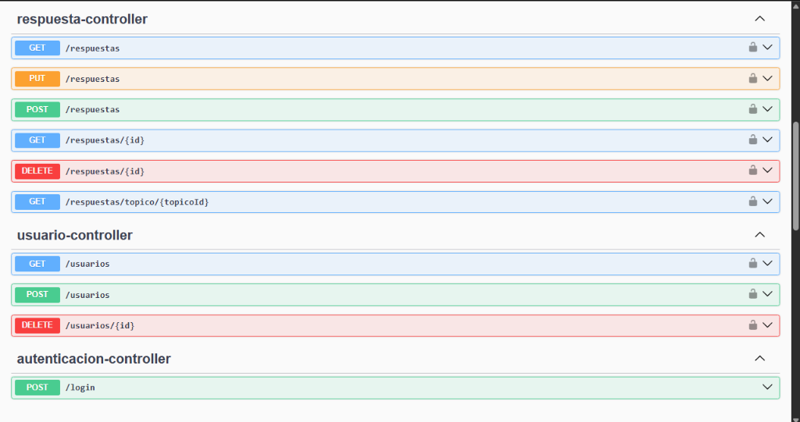

<h1 align="center">ForoHub PWA - Desafío Alura LATAM</h1>

  
  
  
  
  
  

---

## 🚀 Sobre el Proyecto

ForoHub es una Progressive Web Application (PWA) construida como proyecto integral y final para el *Challenge Back-End* de Alura LATAM y Oracle Next Education. Consiste en una arquitectura **Cliente-Servidor (Stateless)** moderna que emula el funcionamiento de StackOverflow o un foro de aprendizaje colaborativo.

La plataforma está diseñada con una estricta separación de responsabilidades:
- **Backend (API REST):** Desarrollado en Java 25 y Spring Boot 4, ofrece seguridad robusta mediante cifrado Bcrypt, Spring Security y **JSON Web Tokens (JWT)**.
- **Frontend (SPA):** Desarrollado con React y Vite, presentando una Interfaz de Usuario (UI) con tema oscuro nativo, glassmorphism, interceptores Fetch E2E y ruteo protegido.

 

    <h3>Pantalla de Autenticación</h3>
    

 

## ⚙️ Arquitectura Multi-Cloud

Este proyecto está 100% alojado en la nube con un pipeline CI/CD activo.

*   **Persistencia (Aiven):** La Base de Datos Relacional MySQL 8 se encuentra orquestada en la nube, recibiendo inyecciones y migraciones de esquemas controladas automáticamente mediante *Flyway*.
*   **Contenedor API (Render):** El Backend de Spring Boot fue dockerizado (multi-stage file) y se ejecuta en un *Web Service* Linux. Interviene en todo el ruteo CORS y valida las peticiones.
*   **Cliente SPA (Vercel):** El Frontend en React está desplegado y servido globalmente con baja latencia mediante la red perimetral de Vercel.

## 🎯 Características Principales (Features)

El sistema cuenta con un abanico completo de funcionalidades CRUD con estado de sesiones:

- **Autenticación con JWT:** Generación de tokens seguros con expiración controlada por el backend tras validación de credenciales.
- **Rutas Protegidas:** Navegación restringida en el CLI con React Router, forzando a usuarios anónimos al Login y verificando persistencia de JWT en LocalStorage.
- **Foro Interactivo (CRUD):** Los usuarios autenticados pueden crear sus propias dudas y visualizar la lista de discusión de otros estudiantes actualizándose en Base de Datos de forma bidireccional E2E.
- **Prevención de Duplicados (Backend):** Implementación de validaciones Spring `@Valid` previendo creación tópicos idénticos (`titulo` y `mensaje`).

 

    

        <h3>Dashboard Interactivo</h3>
        
    

    

        <h3>Formulario CRUD Dinámico</h3>
        
    

 

## 🛠️ Tecnologías y Dependencias

**Backend API (`/`):**
- Spring Web, Spring Data JPA, Spring Security.
- MySQL Connector J / Flyway Migration.
- JWT (Auth0 jsr310).
- Lombok y Spring Boot DevTools.
- Springdoc (Swagger UI OpenAPI).

**Frontend UI (`/forohub-frontend/`):**
- React Vite.
- React Router DOM (v6+).
- Lucide React (Icons).
- Vercel Rewrites Config JSON.
- Vanilla CSS Variables.

---

## 📡 Documentación OpenAPI (Swagger)

Toda la arquitectura de la API cuenta con auto-documentación mediante Swagger UI en producción, sirviendo interfaces graficas sobre los Controladores de Seguridad, Tópicos, Usuarios y Respuestas.

A través de esta documentación viva, es factible conocer el Payload JSON exacto que Spring Boot espera y los Códigos HTTP (`200 OK`, `201 CREATED`, `403 FORBIDDEN`) resultantes:

    
      
    

---

 

> *Desafío de Autenticación, Bases de Datos, Java, Dockerizacion y APIs REST. Completado y documentado bajo control de versiones Git en **Marzo de 2026**. Alura Latam / ONE.*
